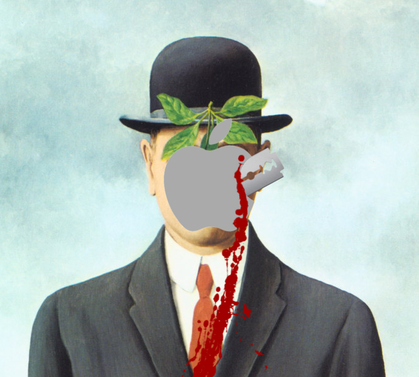

### Kill -9
My "art" "rock" "band" from the 90s, Kill -9
* [Live at the Gun Club Opening](https://www.youtube.com/watch?v=YiRwVuZvO3Q&list=PLq-2vnNfOEye4GFx1eaAlRQCPS4FRvpru)
* [Of Hot Dogs and Hatred](https://www.youtube.com/watch?v=FMAOcTTMYrQ&list=PLq-2vnNfOEycnKAoJiAvqcTDmHcpgGpUa)

### WALF Blow Your Speakers --- All MANOWAR format radio show
My all-MANOWAR radio show in the late 90s:
* [_Metal Warriors_ Sing-along](https://www.youtube.com/watch?v=UpRQrolh9fU&list=PLq-2vnNfOEycvap2JEvQJD2khKYVApq7F&index=3) (excerpt from full show)
* [Full two-hour recording](https://www.youtube.com/watch?v=V7HZFkrAspw&list=PLq-2vnNfOEycvap2JEvQJD2khKYVApq7F&index=2) from 4-6-1998 broadcast

### Ozzy Lives!
In which we were responsible for raising Ozzy Osbourne from the dead via seance.
* [Ozzy Lives!](https://www.youtube.com/watch?v=ljnaf99aUU8)

### [Music For Emma](MusicForEmma.html) 
A comprehensive history of the purposes behind 20th-Century pop music in the form of a mixtape.

### [Grand Jury Notes](http://github.com/grannycart/grand-jury)
What to do if you are picked for a grand jury and you care about, you know, justice.
* Here is a [pdf version](./grand-jury-notes.pdf).

### [Biblography](http://grannycart.net/bibliography/)
Most everything I ever read (listed in bibtex format). Praise for good work, and complaints and arguments against the bad work.

### This is not an apple

